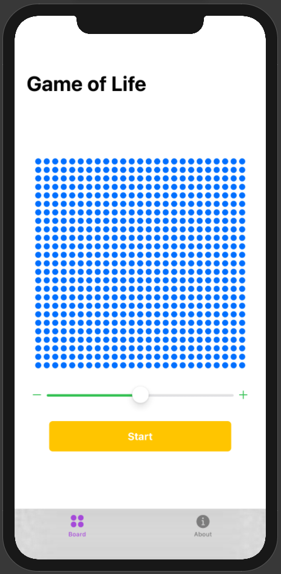
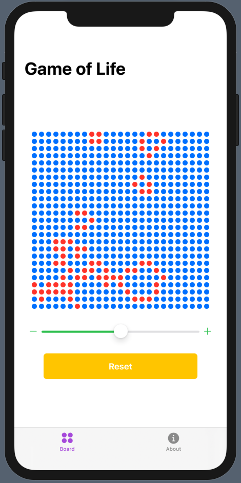

# Conway's Game Of Life

## About
The Game of Life, also known simply as Life, is a cellular automaton devised by the British mathematician John Horton Conway in 1970.[1] It is a zero-player game, meaning that its evolution is determined by its initial state, requiring no further input. One interacts with the Game of Life by creating an initial configuration and observing how it evolves. It is Turing complete and can simulate a universal constructor or any other Turing machine.

## Rules
- Any live cell with two or three live neighbours survives.
- Any dead cell with three live neighbours becomes a live cell.
- All other live cells die in the next generation. Similarly, all other dead cells stay dead.

## Preview

